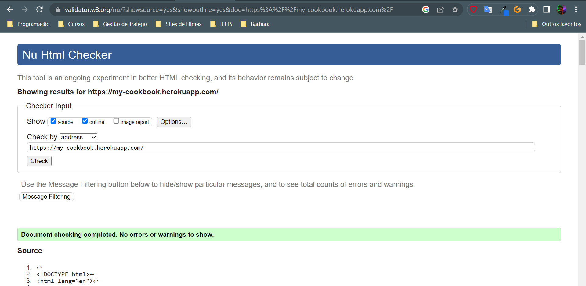
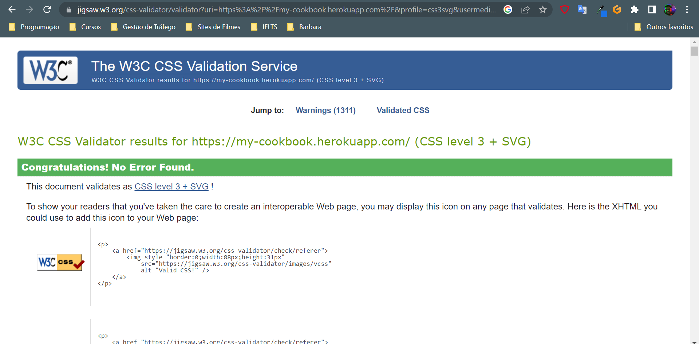

# MyCookbook
 
Project developed for the Full Stack Developer - Code Institute course, using HTML, CSS ,JavaScript, Python and Django to build a website.
 

## Introduction
MyCookbook is a website with the purpose of being an online cookbook, where the user can create, edit and save their favorite recipes. In addition, the site administrator has the ability to make any recipe public, for visitors not registered on the site.  

## Showcase

### Live Website
A deployed link to the website can be found [here](https://my-cookbook.herokuapp.com/)

# Table of Contents
- [Table of Contents](#table-of-contents)
- [Introduction](#introduction)
- [UX](#ux-user-experience)
- [Agile Development Process](#agile-development-process)
- [Design](#design)
- [Features](#features)
- [Technologies Used](#technologies-used)
- [Testing](#testing)
- [Deployment](#deployment)
- [Credits](#credits)
- [Acknowledgements](#acknowledgements)

## UX User Experience
### User Stories

### As the site creator/admin:
* Is possible to have full access and functionality as a superuser
* Is possible to be able to create, read, edit and delete all recipes
* It is possible to view and publish of recipes by a given user for all website visitors, even without registering on the website. 

### As the site user:
* The user is able to register an account
* The user is able to create, read, edit and delete they on recipes
* The user is able to view all other recipes approved by admin by using the search functionality
* The user is able to make changes into the recipe by editing recipe

## Agile Development Process
* The MoSCoW method was adopted to approach to prioritizing which project requirements for must have, should have, could have and will not have.
* I used GitHub for Automated Kanban Project Management. [Click Here]
* I used GitHub project board to generate user story templates.
* I used the automated kanban process and when It is connected to my repo. This allowed me to monitor, track and create user stories.

## Design

 

### Wireframes
 

  
Click here to view all wireframes both Desktop & mobile:

  
  
  

  

 

### Navigation

I created a logic flowchart to help organise the site structure.
The ERD entity relationship diagram helped visually to confirm user roles and the permissions.

  
Click here to view website navigation:

  

  

 
 

## Features
 

### Existing Features
 

### Home Page
Homepage displays the Navbar Brand / logo name, Login, Sign Up and search function on the left.
There is a H1 heading describing what the website is about so that users understand the websites function and target audience.
The main body of the homepage contains 6 recipes and once more than 6 articles are posted pagination shows links to the next page.
Social media network links are displayed in the top page and footer.

 

### Navigation Bar
When not logged in the Navbar displays links to Login and Sign Up.
When a user hovers over navigation links the color changes at the bottom of the links to show responsiveness when the user interacts with the link element(s). When a user is logged in the Navbar displays links to Home, My Recipes, Create Recipe and Logout.

 

### Search Page
When a user searches a particular word the result will return recipes which contain the word searched with the recipes down below. Example below user searched "jambon"

 

### Search Article - No Results

 

### Log in
When a user goes the Login page they are shown a simple form with email and password to sign in.

 

### Sign up
When a user goes to the Sign up page they can enter account details as Name, email and password. If the username and email already exists, an error message will appear. 

 

### Log in messaging 
When a user logs in successfully the same will be directed to the dashboard page, where there is an H1 message from Hello and your recipes already posted.

 

### Log out
When a user goes to the Logout they will be redirected to home page.
 

### Admin - Superuser Access

 

### Create Recipe

 

### User Dashboard

 

## Future Features
* Allows users to like/ unlike a recipe.
* Allows users to filter by recipe creation date
 

## Bugs / Errors encountered during development
* The STATICFILES path was wrong and needed to be fixed.
* It was necessary to correct the code responsible for the Search, as it was not showing the searched recipe, even though it existed, and always showed the message "recipe not found".
* Several tests were made until finding the error that was not allowing deploying on Heroku. The error was in the Config Vars on Heroku itself, a typo in the Cloudinary URL.
* An error in the sign up code does not allow the creation of a new user, always appearing as a blank field.
 
 

### Unfixed Bugs
No known unfixed bugs present at the time of submission
 

## Technologies Used
 

### Languages Used
  * [HTML5](https://developer.mozilla.org/en-US/docs/Web/HTML)
  * [CSS3](https://developer.mozilla.org/en-US/docs/Web/CSS)
  * [JavaScript](https://www.javascript.com/)
  * [Python](https://www.python.org/)
 

### Frameworks, Libraries & Programs Used
* [amiresponsive](http://ami.responsivedesign.is/) to see how responsive the site is on different devices.
* [Balsamiq](https://balsamiq.com/) was used to create the Wireframes.
* [Cloudinary](https://cloudinary.com/) was used to upload, store, manage, manipulate, and deliver images.
* [Django](https://www.djangoproject.com/) is a free and open-source, Python-based web framework that follows the model–template–views architectural pattern.
* [Font Awesome](https://fontawesome.com/) was used for icons for aesthetic and UX purposes on the buttons.
* [GitHub](https://github.com/) GitHub is used to store the projects code after being pushed from Git.
* [Gitpod](https://www.gitpod.io/) An online IDE linked to the GitHub repository used to write my code.
* [Google Chrome Dev tools](https://developer.chrome.com/docs/devtools/) for debugging.
* [Google Lighthouse](https://developers.google.com/web/tools/lighthouse) used for audits to measure the quality of web pages.
* [Heroku](https://www.heroku.com/) used to deploy this app, a cloud platform as a service supporting several programming languages.
* [Pixabay](https://pixabay.com/) Images for this project were sourced from Pixabay.

 

## Testing
 

### Validation Testing
|  | Validations |  Pass/Fail |
| ------------- |-------------|  :----: |
| Chrome   | Lighthouse Report | Pass |
| HTML   | W3C Markup Validator | Error |
| CSS   | W3C CSS Validator | Error |
| Python   | PEP8 online | Pass |
| JS   | JSHint | Pass |
 

### Lighthouse Report
* Ran Lighthouse reports audits to gauge performance, accessibility, and SEO. Gain actionable and reportable insights in real time.
 

  
Click here to see the Lighthouse Report

  

  

 

### The W3C Markup Validator
  

  
Verified using the W3C Markup Validator, which had errors or warnings present. Click here to see the W3C Markup Validator result

  

  

 

### W3C CSS Validator
  

  
Verified using the W3C CSS Validator, which had errors or warnings present. Click here to see the W3C CSS Validator result

  

  

 

### Manual Testing
* Manual testing was completed for each case and edge case scanerio from user log in, user create a recipe, user delete recipe and user log out and  search articles.
* The site was also manually tested on various browsers (Google Chrome, Safari, Microsoft Edge and Firefox.) and on different screen sizes.
* Dev tools was used often to identify errors within HTML and CSS code, with the console feature to identify errors in Javascript code.
* I also used lighthouse reports to see the performance, quality, and correctness of the website.
 

### More manual testing scanerios and results
|   | Pass/Fail |
| ------------- | :----: |
| Selecting heardit logo on homepage directs user back to homepage  |  Pass |
| Selecting Login directs user to /final_user/login/ page  |  Pass |
| Selecting Sign Up directs user to /final_user/signup page |  Pass |
| Selecting My recipes directs user to /final_user/dashboard/ page  |  Pass |
| Selecting Create Recipe directs user to /create/recipe/ page  |  Pass |
| Selecting home directs user to home page  |  Pass |
| Selecting search articles box in navbar and entering a search returns expected result  |  Pass |
| Selecting search articles box in navbar and entering a no results search returns no result page  |  Pass |
| Click on the pagination link at the bottom of the page returns results of the next page (example /?page=2) |  Pass |
| Logging in as superuser / admin |  Pass |
| Logging in as superuser / admin to publish a recipe |  Pass |
| Navigating site as user / admin is permitted |  Pass |
| As admin I can view and publish a recipe |  Pass |
| Updating a post as the author |  Pass |
| Deleting a post as the author |  Pass |
| Logging out as a user / admin directs user to homepage |  Pass |
| Posting a new article requires appropriate fields to be filled in |  Pass |
| Clicking on the social media icons in the footer open the link in a new tab |  Pass |

 

### Responsiveness Browser Compatibility

|  | Chrome | Firefox | Edge | Safari | Pass/Fail |
| ------------- |-------------| -----|  ---------- |  -----| :----: |
| Expected Appearance   | yes | yes  | yes  | yes | Pass |
| Expected Layout   | yes | yes  | yes  | yes | Pass |

 

## Deployment
* This project was developed using a GitPod workspace. The code was committed to Git and pushed to GitHub using the terminal.

* Log in to [Heroku](https://id.heroku.com/login) or create an account
* On the main page click New and Create New App
* Note: new app name must be unique
* Next select your region, I chose Europe.
* Click Create App button
* Click in resources and select Heroku Postgres database
* Click Reveal Config Vars and add new config "SECRET_KEY"
* Click Reveal Config Vars and add new config "CLOUDINARY_URL"
* Click Reveal Config Vars and add new config "DISABLE_COLLECTSTATIC = 1"
* The next page is the project’s Deploy Tab. Click on the Settings Tab and scroll down to Config Vars
* Scroll to the top of the page and choose the Deploy tab
* Select Github as the deployment method
* Confirm you want to connect to GitHub
* Search for the repository name and click the connect button
* Scroll to the bottom of the deploy page and select the preferred deployment type
* Click either Enable Automatic Deploys for automatic deployment when you push updates to Github
 

### Final Deployment 

* Create a Procfile `web: gunicorn heardit.wsgi`
* When development is complete change the debug setting to: `DEBUG = False` in settings.py
* In this project the summernote editor was used so for this to work in Heroku add: `X_FRAME_OPTIONS = SAMEORIGIN `to
   settings.py.
* In Heroku settings, delete the config vars for `DISABLE_COLLECTSTATIC = 1`
 

## Credits

* Code Institute - [Hello Django](https://learn.codeinstitute.net/courses/course-v1:CodeInstitute+FST101+2021_T1/courseware/dc049b343a9b474f8d75822c5fda1582/121ef050096f4546a1c74327a9113ea6/) - Task Manager Walkthrough
* Code Institute - [I think therefore I blog](https://learn.codeinstitute.net/courses/course-v1:CodeInstitute+FST101+2021_T1/courseware/b31493372e764469823578613d11036b/fe4299adcd6743328183aab4e7ec5d13/
) - Django blog project Walkthrough
 

## Acknowledgements
* To create this website, I relied on material covered in the Full Stack Development course by Code Institute.
* I also sourced information and help from a variety of sources such as Slack Community Channels, Udemy, W3Schools, MDN and YouTube for Online Web Tutorials and resources.
* Martina Terlevic for reviewing my work and providing valuable feedback and advice.
* Special thanks to Jhonatan Santos, who helped me to give movement to the project, correcting me and indicating ways for JS and CSS.

This project is for educational use only and was created for the Code Institute Module.